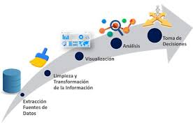
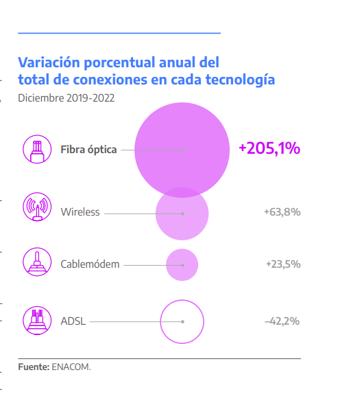

  
  <h1>PI_2 Data Science </h1>

## Análisis de Datos sobre el Acceso al Internet Fijo en Argentina (2014-2022)

Evolución en materia de las diferentes tecnologías, infraestructura, velocidad e ingresos por la prestación del servicio  y su Impacto en la Calidad de Servicio, tanto a nivel nacional como por provincias. 

En el dinámico mundo de las telecomunicaciones en Argentina, nuestro análisis se sumerge en la evolución de las tecnologías de acceso a internet, evaluando la calidad del servicio y proponiendo soluciones personalizadas para mejorar la experiencia del cliente.

  

## Datos y Fuentes

El análisis exploratorio de datos se realizó sobre datos abiertos en la API del Ente Nacional de Comunicaciones (ENACOM) de Argentina. Se consumió la metadata de los conjuntos de datos para responder a preguntas de negocio y establecer el proceso para trabajar con ellos.

El análisis de datos comenzó con el Exploratory Data Analysis (EDA). Se utilizó un Jupyter Notebook en un entorno interactivo de Python para extraer datos del archivo CSV de la API de ENACOM. Se emplearon celdas Markdown para explicar observaciones y se utilizaron diversas visualizaciones, como histogramas y diagramas de dispersión, en el EDA para explorar y entender mejor los datos.

 El primer pasó consistió en crear un Júpiter Notebook, en un entorno de trabajo interactivo web, que permite desarrollar código en Python de manera dinámica para llevar a cabo el EDA. Se extrajo los datos del archivo CSV, de los datos abiertos de la  API de ENACOM. Utilice celdas Markdown para explicar las  observaciones. El Análisis Exploratorio de Datos juega un papel clave en este proceso de análisis de datos ya que este paso me ayudo a dar sentido a los datos e implico visualizarlos para una mejor exploración. Para la visualización, pude elegir entre una serie de opciones, como histogramas, diagramas de dispersión o mapas de calor. Utilice gráficos y visualizaciones para resaltar patrones en los datos. En el EDA también puede encontrar outliers o valores atípicos (donde se puede evaluar, detectar y corregir) , datos nulos y faltantes (NaN), identificación de registros duplicados , recopilar valores únicos, análisis de diferentes tipos de datos, diferentes tipos de variables y correlación entre las variables, revisión estadística de los datasets.

## Creación del Dashboard Interactivo

Posteriormente se da la creación del Dashboard interactivo. Se diseñó un dashboard interactivo en Power BI para permitir a los usuarios explorar los datos de manera efectiva. Se incluyeron filtros e interacciones para facilitar la selección y exploración de datos específicos. Se realizaron Transformaciones adicionales, como limpieza de datos y creación de columnas calculadas, se realizaron directamente en Power BI.

## Cálculo de KPIs y Objetivos del Análisis

Se calcularon y representaron KPIs para:
1. El aumento en el acceso a Internet por cada 100 hogares por provincia.
2. El crecimiento de la fibra óptica como principal medio de transmisión en redes de telecomunicaciones.

Objetivos del análisis de datos:
1. Orientar a la empresa en brindar una buena calidad de servicios.
2. Identificar oportunidades de crecimiento.
3. Plantear soluciones personalizadas a posibles clientes.

## Conclusiones y Resultados

Durante los últimos años se registró un aumento de los accesos a Internet fijos por tipo de red: Banda Ancha y Dial_Up. Se muestra una clara tendencia hacia el uso de la 'Banda ancha fija' en detrimento del 'Dial up'. Este cambio en las preferencias de los usuarios podría tener implicaciones importantes para los proveedores de servicios de internet, quienes podrían necesitar adaptar sus ofertas de servicios para satisfacer la creciente demanda de 'Banda ancha fija', lo cual se traduce en una mejora en la accesibilidad al servicio, que, al incluir a más personas, garantiza condiciones de igualdad en todo el país.

Nuestro análisis muestra una evolución notable en las velocidades de acceso a internet a lo largo de los años. Se generaron cambios hacia Velocidades Más Altas y disminución en las Velocidades Más bajas. Las velocidades de acceso a internet han mejorado significativamente con el tiempo. Esto se debe a los avances en la tecnología de redes y a las inversiones en infraestructura de banda ancha.

También se muestra la participación de diferentes tipos de tecnología en el acceso a internet en Argentina durante el año 2022 por cada uno de los trimestres. Los tipos de tecnología incluyen ADSL, Cablemodem, Fibra óptica, Wireless (Inalámbrica) y Otros. Esto puede ayudar a identificar qué tecnologías son más populares y cuáles son menos utilizadas. Se observa que la Fibra Óptica es la que abarca la mayor cantidad del mercado, la cual puede ayudar en la toma de decisiones al proporcionar una visión clara de la tendencia en el uso del tipo de tecnología.

Si nos enfocamos en los accesos de fibra óptica en Argentina, la tecnología más avanzada y eficiente, se registró un incremento del 229,8% respecto a 2019, ya que pasó de alrededor de 940 mil a más de 3 Millones. Esto se debe fundamentalmente por las políticas implementadas por el Gobierno Nacional, y particularmente por el ENACOM.

En Argentina, las telecomunicaciones constituyen un sector en constante evolución que genera grandes oportunidades de inversión y nuevas fuentes de ingresos. La industria de las telecomunicaciones está marcada por un salto tecnológico sostenido en el tiempo, algo que no sucede con otras industrias, por lo que requiere una inversión constante en nueva tecnología. Argentina es un país con fuertes atractivos para atraer las inversiones que se requieren para hacer frente a la necesidad constante de evolución y conectividad.

**Bibliotecas utilizadas en el proyecto:**
- pandas
- numpy
- matplotlib.pyplot
- seaborn
- plotly.graph_objects

**SET DE LOS DATOS** 

15 Datasets principales (uso de los datos de la API de la empresa ENACOM: Ente nacional de Comunicaciones de Argentina)

*Fuente:* [Dirección Nacional de Desarrollo de la Competencia en Redes y Servicios (ENACOM)](https://www.enacom.gob.ar/institucional)

*Fuente Adicional:* [Informe sobre Telecomunicaciones en Argentina](https://www.inversionycomercio.ar/pdf/sectores/telecomunicaciones/AAICI_TecnoTEL.pdf)

**Nelly Josefina Molina Contreras**

**Data Science** 

